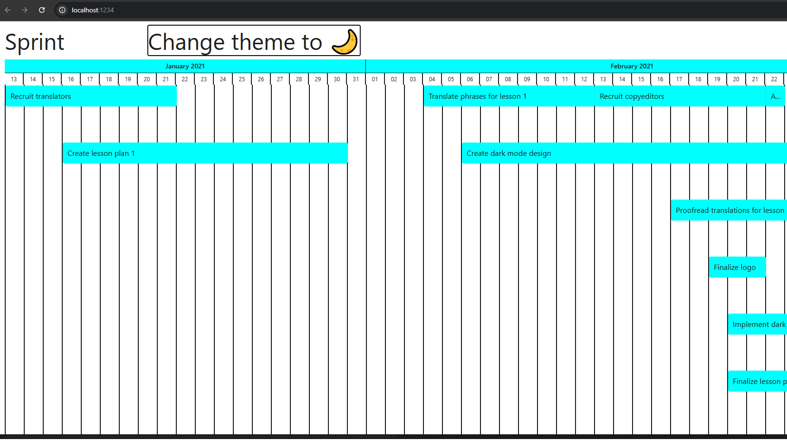

🕒 Timeline Project

Este é um projeto simples e elegante de uma timeline, desenvolvido com React e TypeScript, criado com o objetivo de demonstrar boas práticas de organização, componentização e design responsivo.

Desde o início, busquei estruturar o código de forma limpa e escalável, separando bem os componentes e mantendo uma arquitetura intuitiva para facilitar futuras manutenções. Além disso, implementei um sistema de temas que permite alternar entre modo claro e escuro, tornando a experiência mais agradável e personalizada para cada usuário.

Visualmente, o projeto ficou bonito, fluido e moderno, com uma interface minimalista que valoriza a usabilidade sem abrir mão do estilo. A proposta foi criar algo simples, rápido e intuitivo, que pudesse ser facilmente entendido e utilizado por qualquer pessoa.

Se tivesse mais tempo, exploraria melhorias em testes de responsividade, refinamento de UI/UX e novas visualizações da timeline, permitindo adaptar a experiência para diferentes perfis de usuários

🚀 Como executar o projeto

npm install
npm start

